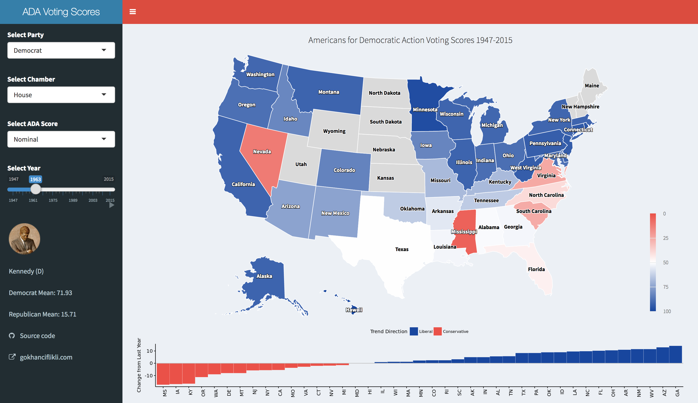

###Tracking Legislator Voting Patterns
How do the legislators vote once they get elected? Or, perhaps more dynamically, how do they react to external shocks (e.g. the dissolution of the Soviet Union, 9/11)? How does voting behavior change over time and space? Let's try to answer these questions with R. You can jump straight to the interactive Shiny app by clicking [here](
https://gokhan.shinyapps.io/adamap/).

###Data
Organizations such as the [Americans for Democratic Action](http://www.adaction.org/), among other things, track the consistency of the legislators by documenting their voting patterns. An aggregated version of their data, compiled by [Justin Briggs](http://trialstravails.blogspot.co.uk/2017/01/adjusted-ada-scores-from-1947-2015.html), provides district-level voting data grouped by year, state, chamber, and party from 1947 to 2015. In addition to the nominal ADA voting scores, he also provides adjusted scores based on [this post](http://timgroseclose.com/adjusted-interest-group-scores/) by Tim Groseclose.

```{r, message=FALSE, warning=FALSE}
library(dplyr)
library(readxl)
adaData <- read_excel("ada4715.xlsx") #aforementioned dataset
glimpse(adaData)
```

Still, some `dplyr` action will be needed to accomplish the task. We are probably interested in some averages for comparison. For starters, we can get the yearly averages by chamber and party:

```{r, message=FALSE, warning=FALSE}
annual <- adaData %>%
  group_by(Year, Chamber, Party) %>%
  summarise(ADA = round(mean(Nominal.Score), 2),
            aADA = round(mean(Adjusted.Score), 2))
head(annual)
```

_American Labor?_ Good old times, eh. Next, we include states to track them over time:

```{r, message=FALSE, warning=FALSE}
states <- adaData %>%
  group_by(Year, StateAbbr, Chamber, Party) %>%
  summarise(ADA = round(mean(Nominal.Score), 2),
            aADA = round(mean(Adjusted.Score), 2))
head(states)
```

We create multiple copies via `dplyr` primarily for the Shiny app in mind. Also note that some year/state/chamber combinations will be missing depending on the elections. Finally, we want some indicator of within-state change. A basic way of doing this would be calculating a lagged value of a grouping set:

```{r, message=FALSE, warning=FALSE}
trend <- states  %>%
  arrange(Year) %>%
  group_by(StateAbbr, Chamber, Party) %>%
  mutate(Diff = ADA - lag(ADA),
         Diff2 = aADA - lag(aADA))
head(trend[trend$Year == 1948, ]) #First year will have NAs because of the lag structure
```

At this point, might as well provide a baseline value to signal the change from last year; that is, whether the shift is toward liberalism or conservatism:

```{r, message=FALSE, warning=FALSE}
trend$Threshold <- factor(ifelse(trend$Diff > 0, "Liberal", "Conservative"),
                          levels = c("Liberal", "Conservative"))
trend$Threshold2 <- factor(ifelse(trend$Diff2 > 0, "Liberal", "Conservative"),
                          levels = c("Liberal", "Conservative"))
head(trend[trend$Year == 1948, 6:10], n = 2)
```

This wraps up the data setup.

###Visualization

There are many good R packages for charting maps. One of the better looking ones is `highcharter`.[^1] It is powered by `htmlwidgets` so it comes with build-in Shiny integration. You can chart US states by simply calling:

```{r, message=FALSE, warning=FALSE}
library(highcharter)
hcmap("countries/us/us-all")
```

`hcmap` creates an interactive legend by default; if you click on 'Series 1', the map will disappear because we have yet to project any other data. You can turn this behavior off by passing `showInLegend = FALSE`. You can also [get and download](http://jkunst.com/highcharter/highmaps.html) the map data:

```{r, message=FALSE, warning=FALSE}
mapData <- get_data_from_map(download_map_data("countries/us/us-all"))
head(mapData$`hc-a2`)
```

We see that state abbreviations are stores in `hc-a2`. We will us this as the key to match data in the states data set. Let's map House Democrats in 1963:

```{r, message=FALSE, warning=FALSE}
hd63 <- states[states$Year == 1963 & states$Party == "Democrat" & states$Chamber == 1, ]
head(hd63)

mapData <- (download_map_data("countries/us/us-all")) #We overrride the version we downloaded in the previous chunk

hc <- highchart(type = "map") %>%
          hc_add_series_map(map = mapData,                       #map data
                            df = hd63,                           #voting score data subset
                            value = "ADA",                       #variable to map from df
                            joinBy = c("hc-a2", "StateAbbr"),    #linking map and data by state
                            name = "ADA Voting Score",           #hover title
                            nullColor = "#dadada",               #null color for NAs
                            borderColor = "white",               #border outline color
                            dataLabels = list(enabled = TRUE,    #hover data display
                            format = '{point.name}'))    
hc
```

Looks good for a first cut. We first call the appropriate map data from [highcharts.com](https://code.highcharts.com/mapdata/). We specify the data set of interest with `df`. `value` takes a string that specifies the variable we want to chart. `joinBy` links the two data sets by a matching variable; in our case abbreviated state codes. I assigned a null color to differentiate zeros from `NA`s.

Let's add a title and a legend. Similar to `ggplot`, `highcharter` uses the pipe operator to it's a breeze:

```{r, message=FALSE, warning=FALSE}
hc %>%
hc_title(text = "1963 House Democrats ADA Voting Scores") %>%
hc_legend(layout = "vertical", align = "right", floating = TRUE, valueDecimals = 0)
```

Still, the colors can use more work. At it is now, we get a spectrum between 0 and 100, with the former signaling a slide towards conservatism and the latter conveying more liberal voting patterns. You might want to assign canonical colors of the parties to advertise these shifts. For this, we need to supply stop breaks to the `hc_colorAxis`. Say we want to assign red to 0, blue to 100, and white to 50 (to display moderation/on the fence behavior):

```{r, message=FALSE, warning=FALSE}
stops <- data.frame(q = c(0, .5, 1),
                    c = c("#ea5148", "#ffffff", "#18469e"))
stops
stops <- list_parse2(stops)    #highcharter wrapper
hc_colorAxis(hc, stops = stops)
```

If you want to keep the title and the legend, just pipe (`%>%`) them in during the initialization of `hc`:

```{r, message=FALSE, warning=FALSE}
hc <- highchart(type = "map") %>%
          hc_add_series_map(map = mapData, df = hd63, value = "ADA", joinBy = c("hc-a2", "StateAbbr"),    
                            name = "ADA Voting Score", nullColor = "#dadada", borderColor = "black", #for visibility           
                            dataLabels = list(enabled = TRUE, format = '{point.name}')) %>%
          hc_title(text = "1963 House Democrats ADA Voting Scores") %>%
          hc_legend(layout = "vertical", align = "right", floating = TRUE, valueDecimals = 0)
hc_colorAxis(hc, stops = stops)
```

We can also convey yearly changes with a deviation plot using the `ggpubr` package. We have already calculates within-state change by lagging the ADA scores by one year after grouping. `ggpubr` as the name suggests builds on `ggplot` so the grammar works the way you would expect:

```{r, message=FALSE, warning=FALSE}
hd63T <- trend[trend$Year == 1963 & trend$Party == "Democrat" & trend$Chamber == 1, ]
library(ggpubr)
p <- ggbarplot(data = hd63T,
               x = "StateAbbr",
               y = "Diff",                               #use difference in nominal score
               fill = "Threshold",                       #factor identifying negative/positive scores
               color = "white", size = .1, width = 1,    #bin color, size, outline
               palette = c("#18469e", "#ea5148"),        #red/blue colorway
               sort.val = "asc",                         #sort by ascending value
               sort.by.groups = FALSE,                   #do not sort by group
               x.text.angle = 90,                        #rotate x axis text
               ylab = "Change from Last Year",
               xlab = FALSE,                             #hide x axis
               legend.title = "Trend Direction")
p +
geom_abline(slope = 0, color = "gray")                   #add a reference line at zero
```

All good and well, however showing stats from a single year (plus only one chamber, one party) is not that captivating. Enter `Shiny`. I will not go into the details of building the app, as the code is publicly available on [GitHub](https://github.com/ciflikli/adamap).[^2] Instead, I will briefly touch on how to transform the above code into reactive programming.

Assume we want to allow the users to switch years, chambers, party, and ADA score type. In order words, we need to have input on these four variables. The easiest way is to create a dynamic subsetting mechanism. An example would be:

```{r, eval=FALSE, message=FALSE, warning=FALSE}
#Not evaluated
selectedData <- reactive({
    states <- states[states$Year == input$Year & states$Party == input$Party &
                         states$Chamber == ifelse(input$Chamber == "House", 1, 2), ]
  })
```

This creates a reactive data set called `selectedData()` that changes according to user input to any of the variables defined above. Within `Shiny`, you have to call reactive items with brackets(). Using them outside of `reactive` environments will also not work. Below is a screenshot of the opening page of the completed app:



If you made it this far and still haven't checked the app, you should now! The inclusion of president portraits took some consideration, however it made the strong case for starting with JFK. 

[^1]: Get inspired at http://jkunst.com/highcharter/index.html
[^2]: Which assumes some understanding of how `Shiny` works.